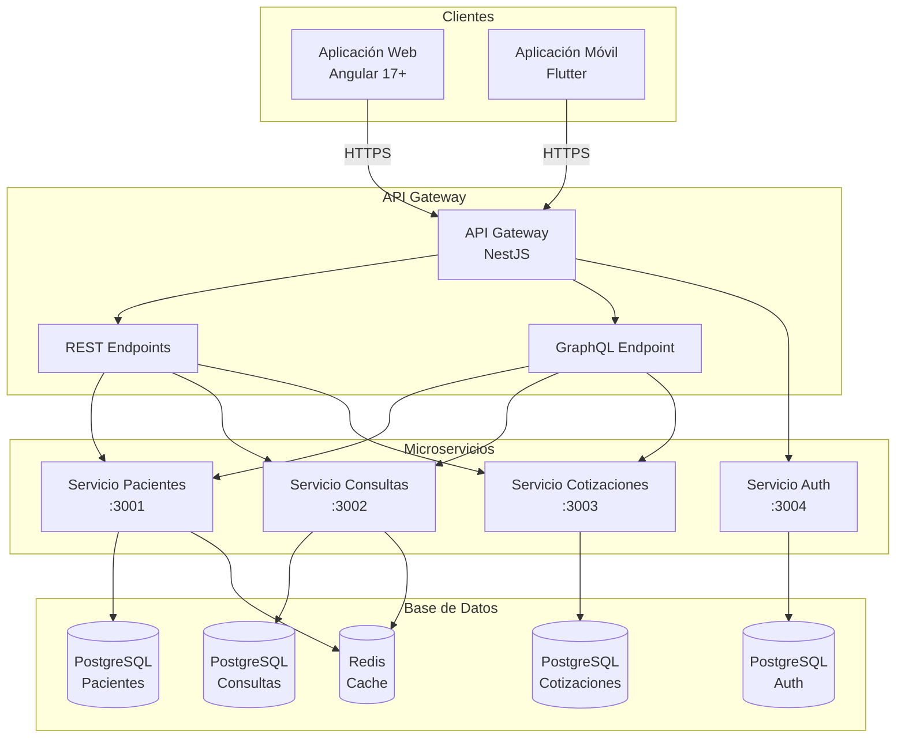

# Diagrama de Arquitectura del Sistema

## Descripción General
Arquitectura del sistema de gestión de salud para CBES, diseñada con un enfoque de microservicios que separa las responsabilidades en componentes independientes, comunicados a través de un API Gateway central.

## Componentes Principales

### 1. Cliente (Frontend)
- **Aplicación Web:** Angular 17+ (SPA)
- **Aplicación Móvil:** Flutter
- Ambos clientes se comunican exclusivamente con el API Gateway

### 2. API Gateway
- Punto de entrada único para todas las solicitudes
- Gestiona autenticación (JWT), rate limiting y enrutamiento
- Expone endpoints REST y GraphQL según la necesidad del cliente

### 3. Microservicios

#### Servicio de Pacientes
- Gestión del registro y datos de asegurados
- Base de datos: PostgreSQL
- Puerto: 3001

#### Servicio de Consultas Médicas
- Registro de consultas, diagnósticos y recetas
- Base de datos: PostgreSQL
- Puerto: 3002

#### Servicio de Cotizaciones
- Control de aportes y cotizaciones de asegurados
- Base de datos: PostgreSQL
- Puerto: 3003

#### Servicio de Autenticación
- Gestión de usuarios, roles y permisos
- Emisión y validación de tokens JWT
- Base de datos: PostgreSQL
- Puerto: 3004

### 4. Capa de Datos
- **PostgreSQL:** Base de datos principal para cada microservicio
- **Redis:** Caché de sesiones y datos frecuentes

### 5. Infraestructura
- **Docker:** Contenedorización de cada servicio
- **PM2:** Gestión de procesos en producción
- **Nginx:** Reverse proxy y servidor de archivos estáticos

## Diagrama de Arquitectura


## Flujo de Datos

### Flujo REST (Ejemplo: Obtener paciente)
```
Cliente → API Gateway → /v1/pacientes/:id → Servicio Pacientes → PostgreSQL
                                                                  ↓
Cliente ← API Gateway ← JSON completo ← Servicio Pacientes ← Resultado DB
```

### Flujo GraphQL (Ejemplo: Paciente con consultas)
```
Cliente → API Gateway → /graphql → Servicio Pacientes → PostgreSQL
                                  → Servicio Consultas → PostgreSQL
                                          ↓
Cliente ← API Gateway ← JSON específico (solo campos solicitados)
```

## Tecnologías Utilizadas

| Capa | Tecnología | Propósito |
|------|-----------|-----------|
| Frontend Web | Angular 17+ | Aplicación SPA |
| Frontend Móvil | Flutter | App multiplataforma |
| API Gateway | NestJS | Enrutamiento y autenticación |
| Microservicios | NestJS | Lógica de negocio |
| Base de Datos | PostgreSQL | Persistencia de datos |
| Caché | Redis | Rendimiento y sesiones |
| Contenedores | Docker | Despliegue y aislamiento |
| Proxy | Nginx | Reverse proxy |
| Procesos | PM2 | Gestión en producción |

## Decisiones de Arquitectura
1. **Microservicios sobre monolito:** Permite escalar cada servicio de forma independiente según la demanda
2. **API Gateway dual (REST + GraphQL):** REST para operaciones CRUD simples, GraphQL para consultas complejas con datos relacionados
3. **Base de datos por servicio:** Cada microservicio tiene su propia base de datos para garantizar el bajo acoplamiento
4. **Docker:** Facilita el despliegue consistente entre ambientes de desarrollo y producción
